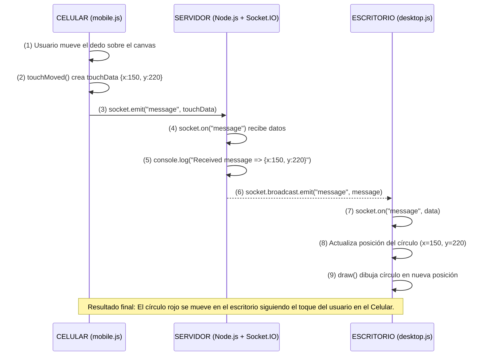

# Evidencias de la unidad 7

¿Qué URL de Dev Tunnels obtuviste? ¿Por qué crees que necesitamos usar esta URL en lugar de http://localhost:3000 o la IP local de tu computador para que el celular se conecte?

obtuve la siguiente URL: https://f51lclcj-3000.use2.devtunnels.ms/ 
Cuando se trabaja con servidores locales, al usar `https://localhost:3000` esto significa que el servidor solamente va a funcionar dentro del mismo computador en donde se está corriendo el servidor debido a que cuando se usa local host este **apunta a la dirección de si mismo**, el loopback de la máquina, por lo que cuando el celular o cualquier otro dispositivo intenta acceder a esta misma dirección url, este va a buscar una dirección en su propio sistema, no en un sistema externo.


Describe brevemente qué hace npm install y npm start.

`npm install` se encarga de instalar las dependencias (librerías y módulos) que el proyecto necesita de acuerdo a lo que se indique en el archivo de `package.json`, básicamente este se encarga de preparar el entorno para que la aplicación se pueda ejecutar de forma adecuada.

Por otra parte, el `npm start` ejecuta elcomando definido en la sección scripts del `package.json` bajo la sección `start` Normalmente esta suele ser la que inicia el sevidor de desarrollo o lanza la aplicación.

¿Qué mensajes observaste en la terminal del servidor al conectar el cliente de escritorio y el cliente móvil? ¿Eran diferentes los mensajes o identificadores?

Cuando se conecta el cliente de escritorio y el cliente movil aparecen los mismos mensajes `New Client Connected`, no especifica cual.

Describe el comportamiento observado: ¿Funcionó la interacción? ¿Hubo algún retraso (latencia)?

Cuando se abren los dos clientes, por la parte de mobile aparece lo siguiente:


Por otra parte, para la aplicación de escritorio aparece lo siguiente:


---

El sistema funciona de la siguiente manera, cuando se pone el dedo encima en la aplicación de escritorio, este envía señales de tipo touch con las coordenadas en donde se está detectando el dedo, luego, estas mismas coordenadas son recibidas por la pestaña de escritorio la cual se encarga de darle movimiento a la bolita siguiendo las mismas coordanadas de movimiento que sigue el dedo, si bien hay un poco de delay, este es demasiado poco que puede llegar a percibirse solo durante unos instantes.

## Actividad 2

### Explica con tus propias palabras: ¿Por qué es necesario Dev Tunnels en este escenario y cómo funciona conceptualmente?
Según lo que tengo entendido, Dev Tunnels es una especie de "tunel seguro" para poder acceder a la aplicación por fuera del entorno de ejecución local, la aplciación funciona algo así:
    - La aplicación se ejecuta inicialmente en un entorno local desde un puerto, como se ha estado trabajando, podría ponerse de ejemplo el puerto 3000 `http://localhost:3000`
    - Dev Tunnels se encarga de crear puerto de conexión cifrada (https) entre el pc y los servidores de Microsoft.
    - Luego estos servidores dan una URL pública que apunta directamente al tunel local, posterior a eso
      - La solicitud pasa por el servidor de Dev Tunnels.
      - Este la redirige a la aplicación local.
      - app responde, y la respuesta viaja de vuelta por el túnel al cliente remoto.

### Describe la función de touchMoved()
- La función `touchMoved()`es una función que se ejcuta por p5.js, esta se ejecuta cuando el usuario arrastra el dedo sobre el canvas en el cliente móvil.
- Dentro de esta función se comprueba de que exista la conexión socket y que esté conectada: `if (socket && socket.connected)`.
- Luego esta calcula el desplaamiento desde la última posición de toque registrada por medio de las siguientes lineas de código:
  
```js
let dx = abs(mouseX - lastTouchX);
let dy = abs(mouseY - lastTouchY);
```
En celulares, los valores mouseX y mouseY representan la posición de toque activa.

- Es solo cuando el desplazamiento supera cierto umbral (o si antes no habían posiciones registradas) que se crea un objeto touchData con `{ type: 'touch', x: mouseX, y: mouseY }` y este es enviado al servidor via Socket.IO
- Despues de la emisión este actualiza `lastTouchX` y `lastTouchY` con la nueva posición
- Por último retorna `false` para evitar el comportamiento que tiene por defecto del navegador que es el de scrollear cuando se toca el canvas.

  
### Por qué se usa la variable threshold en el cliente móvil.

La variable treshold (`const threshold = 5;`) se encarga de definir la distancia mínima en pixeles que debe cambiar la posición entre envíos sucesivos para que se emita un nuevo mensaje. Esta es una función que se encarga de reducir el jitter puesto que los sensores táctiles peuden llegar a dar pequeñas variaciones cuando el dedo puede llegar a estar incluso quieto, este umbral se encarga de evitar esos cambios insignificantes, aparte de que se encarga de ahorrar ancho de banda y CPU puesto que evta enviar demasiados pensajes por Socket.IO cuando no hay movimientos reales. aparte de que evita que la aplicación reciba muchos eventos y se vea que tiembla por micromovimientos.

### Compara brevemente Dev Tunnels con simplemente usar la IP local. ¿Cuáles son las ventajas y desventajas de cada uno?

|Puntos|Uso de IPs|Uso de Dev Tunnels|
|----|----|----|
|Accesibilidad|Solo funciona utilizando la misma red Wi-Fi, en caso de que no, esta no va a funcionar|Cuando de utiliza Dev Tunnels, esta es accesible de sde cualquier red y cualquier dispositivo movil, no hay que estar conectado a una red en específico para poder funcionar adecuadamente|


- Coloca en tu bitácora capturas de pantalla del sistema completo funcionando. Esto lo puedes hacer abriendo tanto el mobile como el desktop en tu computador y tomando una captura de pantalla de todos los involucrados (celular, computador y terminal).

  

https://github.com/user-attachments/assets/95a15116-0613-457e-b1bc-bbd56d5084dd


## Actividad 3


- ¿Cuál es la función principal de `express.static(‘public’)` en este servidor? ¿Cómo se compara con el uso de app.get(‘/ruta’, …) del servidor de la Unidad 6?

`express.static(‘public’)` actúa como un *middleware* que sirve archivos estáticos (HTML, CSS, JS, imágenes, etc.) desde la carpeta public.
  - Si en `public` hay por ejemplo, un `index.html`, una petición GET a `/` va a devolver automáticamente ese `index.html`
  - También resuelve rutas como `/css/styles.css` devolviendo el archivo `public/css/styles.css`.
  - Es rápido y está pensado para contenido fijo que no necesita de una lógica de servidor.

Por otra parte, `app.get('/ruta', ...)` es un *manejador de ruta* que define el propio programador con el código: cuando llega una petición GET a `/ruta`, se ejecuta la función que se ponga y se puede generar contenido de una forma dinámica, acceder a bases de datos, devolver JSONs, entre muchos otros

      

- Explica detalladamente el flujo de un mensaje táctil: ¿Qué evento lo recibe el servidor? ¿Qué hace el servidor con él? ¿Qué evento lo envía el servidor al escritorio? ¿Por qué se usa socket.broadcast.emit en lugar de io.emit o socket.emit en este caso?

1) Qué evento lo envía desde el móvil?

    - Evento de p5.js: `touchMoved()` — se dispara cada vez que el dedo se mueve sobre el canvas.
    - Dentro de `touchMoved()` el código genera un objeto `touchData`:
```js
let touchData = { type: 'touch', x: mouseX, y: mouseY };
```
-
    - Y lo envía al servidor con Socket.IO:
```js
socket.emit('message', touchData);
```

2) ¿Qué evento lo recibe el servidor?

    - En el servidor Node.js escucha:
```js
socket.on('message', (message) => { ... });
```
-
    - Aquí `socket` es la conexión del cliente móvil que emitió el mensaje, y `message` es el objeto `{ type:'touch', x, y }`.

3) ¿Qué hace el servidor con él?

Dentro del handler:
    - Lo registra para depuración:
```js
console.log('Received message =>', message);
```
-
    - Lo retransmite a otros clientes con:
```js
socket.broadcast.emit('message', message);
```

- Es decir: guarda/loggea y reenvía el mismo payload a todos los demás sockets conectados (excepto el que lo envió).

4) ¿Qué evento lo envía el servidor al escritorio?

    - El servidor emite el mismo evento `'message'`:
```js
socket.broadcast.emit('message', message);
```

En el lado del escritorio (`desktop.js`) lo reciben con:
```js
socket.on('message', (data) => {
  if (data && data.type === 'touch') {
    circleX = data.x;
    circleY = data.y;
  }
});
```


5) ¿Por qué `socket.broadcast.emit` y no `io.emit` o `socket.emit`?

`socket.emit('message', ...)` solo envía al emisor (el celular).
Acá no es útil porque el emisor ya conoce su propio toque y no necesita recibirlo otra vez.

`io.emit('message', ...)` envía a todos los sockets, incluido el emisor.
Esto causaría un eco/duplicado en el celular (recibiría su propio evento desde el servidor), y puede generar lógica redundante o parpadeos en la UI.

`socket.broadcast.emit('message', ...)` envía a todos menos el socket que originó el mensaje.
Este es ideal para sincronizar otros clientes (escritorios) sin devolver el evento al origen.

Unas ventajas de usar `socket.broadcast.emit`:
    - Evita duplicados en el origen.
    - Reduce tráfico innecesario al emisor.
    - Es la semántica correcta para “retransmitir a los demás”.

- Si conectaras dos computadores de escritorio y un móvil a este servidor, y movieras el dedo en el móvil, ¿Quién recibiría el mensaje retransmitido por el servidor? ¿Por qué?

Al mover el dedo en el móvil, solo los dos escritorios reciben el mensaje retransmitido por el servidor, porque `socket.broadcast.emit` excluye al emisor (el celular) y envía el evento a todos los demás clientes conectados.

- ¿Qué información útil te proporcionan los mensajes console.log en el servidor durante la ejecución?

Los mensajes console.log del servidor dan información de diagnóstico y seguimiento muy útil durante la ejecución del sistema, ya que te permiten saber qué está ocurriendo en tiempo real con las conexiones y los mensajes.


## Actividad 4

## Actividad 5
IDEA: Inicialmente hice la propuesta de hacer un sistema tipo synthwave, que combinara los colores de Tron y utilizara los táctiles del celular para hacer explotar cajas dentro de este y que emitieran partículas que siguieran el ritmo de la canción, desafortunadamente el proyecto no salió en terminos de programación como esperaba debido a la complejidad que es programar aspectos en 3d con mis conocimientos en programación y debido a que las IAs tampoco fueron muy fáciles de usar debido a que realizaba la idea pero no de la forma como yo quería que funcionara, así que opté por cambiar tanto de tema musical como de idea de diseño, para este caso utilice el tema de **Give Life Back To Music** de Daft Punk, para este quise hacer algo más relacionado a la vida, por ejemplo que hubieran edificios y que estos cambiaran con el paso de la canción, adicional a esto quise implementar para el usuario la posibilidad de plantar flores y que este pudiese controlar la velocidad en la que estas crecen y que cuando terminen de crecer sigan el ritmo de la música, es un estilo que para mi giusto es más sencillo pero es mucho más realizable e incluso bonito

Boceto de idea


Link al [GitHub](https://github.com/KiwisCas/ActividadInteractiva)


## Autoevaluación

| Actividad   | Evidencias / Comentarios                                                                                                | Calificación (1-5) | Justificación                                                                                                     |
| ----------- | ----------------------------------------------------------------------------------------------------------------------- | ------------------ | ----------------------------------------------------------------------------------------------------------------- |
| Actividad 1 | URL de Dev Tunnels, explicación de `npm install` y `npm start`, comportamiento observado con capturas                   | 5                  | Explicación clara y completa con evidencias visuales; demuestra comprensión del tema.                             |
| Actividad 2 | Explicación de Dev Tunnels, funcionamiento conceptual, `touchMoved()` y `threshold`, comparación con IP local           | 5                  | Descripción técnica detallada y correcta, incluye justificación del uso de Dev Tunnels y optimización de eventos. |
| Actividad 3 | Función `express.static`, flujo de mensajes táctiles, uso de `socket.broadcast.emit`, escenarios con múltiples clientes | 5                  | Flujo explicado paso a paso, correcta comprensión de eventos y roles de Socket.IO; evidencia textual clara.       |
| Actividad 4 | Diagrama de secuencia Mermaid mostrando flujo de mensajes y resultado final                                             | 5                  | Diagrama claro y completo, refleja correctamente la interacción entre móvil, servidor y escritorio.               |
| Actividad 5 | Idea interactiva, explicación de cambios de diseño, boceto y link a GitHub                                              | 5                  | Presenta un diseño detallado, justificación del cambio de enfoque y evidencia gráfica y de repositorio.           |


