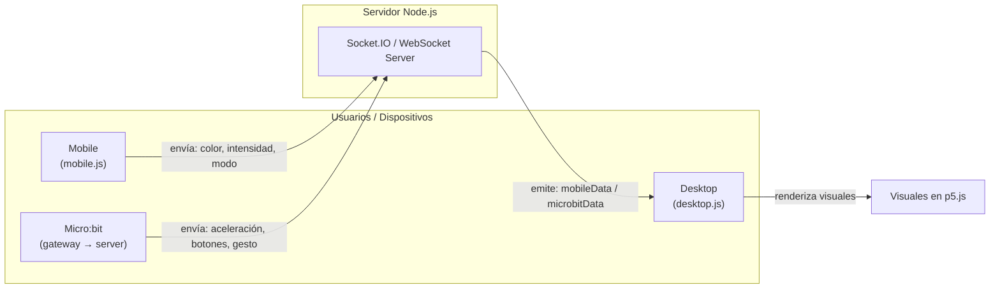

# Evidencias de la unidad 8


## Referentes visuales

Los referentes que inspiraron este proyecto fueron:

- **Patatap** → por su forma de mezclar música y animación.  
- **Visualizadores musicales** (como los de YouTube o Spotify Canvas) → por las ondas que responden al ritmo.  
- **Efectos de partículas y mallas 3D** → por su movimiento suave y natural, parecido a un paisaje que vibra.

Estos referentes muestran cómo el sonido puede “pintar” el movimiento en pantalla, lo que se refleja en las visuales del proyecto.

---

## Concepto de las visuales

El concepto se llama **“Resonancias”** y busca mostrar cómo el sonido y las acciones físicas se convierten en imagen.

- La **malla** reacciona como un mar que vibra con la música.  
- Las **letras** aparecen una por una, como si flotaran sobre las ondas.  
- Las **partículas** explotan con los golpes de los bajos.  
- Los **colores** cambian según lo que el usuario hace desde su celular.  
- El **micro:bit** agrega movimiento y efectos físicos.

**Frase clave:**  
> “La música vibra y el entorno responde.”

---

## Control con móvil

### Móvil (`mobile.js`)
- Usa **Socket.IO** para comunicarse con el servidor.  
- El usuario controla el color y la intensidad moviendo el dedo en la pantalla.  
- También puede cambiar el modo (por ejemplo, entre “wave”, “pulse”, o “spiral”).  
- Los datos enviados al servidor son del tipo:

```json
{
  "fromMobile": {
    "colorR": 255,
    "colorG": 180,
    "colorB": 90,
    "intensity": 1.4,
    "mode": "wave"
  }
}
```

## Diagrama


# Contrucción

### 1. **Investigación y planeación**
Primero busqué referentes visuales en páginas y videos de artistas digitales. Me interesaban mucho los visualizadores musicales y los proyectos de p5.js que mezclaban sonido con movimiento.  
A partir de eso, definí que quería una malla que reaccionara a la música y que el color se pudiera cambiar desde el celular.

---

### 2. **Creación del servidor Node.js**
Usé **Express** y **Socket.IO** para que varios dispositivos se conectaran entre sí.  
Configuré un servidor simple con los siguientes objetivos:
- Enviar datos desde el **móvil** al **visualizador (desktop)**.
- Recibir, si era posible, datos del **micro:bit**.
- Mantener actualizadas las visuales en tiempo real.

Al principio me costó entender cómo usar `socket.emit` y `socket.on`, pero después logré que el móvil enviara los datos correctamente.

---

### 3. **Desarrollo del visualizador (`desktop.js`)**
En esta parte usé **p5.js**. Creé una malla de puntos y triángulos que se mueve al ritmo del audio.  
También agregué:
- Letras que cambian cada cierto tiempo.  
- Un sistema de partículas que aparece cuando la música tiene picos de energía.  
- Un control de color y brillo, para que respondiera al celular.

Logré que los datos del móvil cambiaran los colores y la intensidad de las ondas, lo cual fue el primer gran logro del proyecto.

---

### 4. **Desarrollo del controlador móvil (`mobile.js`)**
En el celular, hice una versión de p5.js que detecta la posición del dedo.  
Cada vez que se mueve, envía:
- **Color (R,G,B)** → según la posición X e Y.  
- **Intensidad** → según la velocidad del movimiento.  
- **Modo** → cambia con toques rápidos.

Después de varias pruebas logré que el celular se conectara al servidor y modificara las visuales en tiempo real.  
Este fue el punto donde todo empezó a verse como una experiencia interactiva completa.

---

### 5. **Intento de conexión con el micro:bit (`client.js`)**
Esta parte fue la más difícil.  
La idea era que el micro:bit mandara datos de movimiento (acelerómetro) y botones, para que se reflejaran en la animación (por ejemplo, mover el micro:bit para deformar la malla o presionar A/B para cambiar el modo).

Sin embargo:
- Tuve problemas al conectar el micro:bit con el servidor.  
- Lograba enviar algunos datos por el puerto serie, pero no llegaban correctamente al navegador.  
- Intenté con `WebSocket` y también con `Socket.IO`, pero no logré que ambos sistemas fueran compatibles.

Por eso, en la versión final el micro:bit **no está funcionando aún**

---

### 6. **Pruebas y ajustes finales**
Probé la aplicación en varios dispositivos:
- En el computador con el visualizador.  
- En el celular, moviendo el dedo por la pantalla.  

## Prueba


https://github.com/user-attachments/assets/83c36aef-e122-4094-8c8a-e208041d6a27


## Link GitHub

[link](https://github.com/KiwisCas/FINALSFI)


# Autoevaluación

| **Aspecto evaluado**                     | **Calificación (0-5)** | **Justificación personal**                                                                                                                          |
| ---------------------------------------- | ---------------------- | --------------------------------------------------------------------------------------------------------------------------------------------------- |
| **Referentes visuales**                  | **5.0**                | Los referentes fueron adecuados y aportaron mucho a la estética final. Elegí bien las influencias y las conecté con mi propuesta.                   |
| **Concepto de las visuales**             | **4.5**                | El concepto “Resonancias” está bien planteado y coherente, pero podría haberlo profundizado más en su relación con la experiencia del usuario.      |
| **Control con móvil y micro:bit**        | **3.5**                | El control con el móvil funcionó bien, pero el micro:bit no se integró correctamente, lo que limita el objetivo completo del sistema.               |
| **Bocetos e interfaces**                 | **2.5**                | No incluí bocetos visuales , algo importante para mostrar el diseño previo y la planificación visual.                       |
| **Diagrama del sistema**                 | **5.0**                | El diagrama técnico es claro y comunica bien cómo se conectan todos los componentes.                                                                |
| **Documentación del proceso**            | **4.5**                | Documenté todas las fases, aunque podría haber incluido más capturas del proceso intermedio.                                                        |
| **Códigos incluidos**                    | **5.0**                | Están todos los archivos principales y las funciones explicadas. El código refleja bien lo aprendido durante el proceso.                            |
| **Funcionamiento general (actividad 2)** | **3.5**                | El sistema es funcional entre el celular y el visualizador, pero no completamente terminado por la falta del micro:bit y algunos detalles visuales. |
| **Presentación y evidencias**            | **4.5**                | Entregué video, imagen y repositorio en GitHub, pero me faltó incluir capturas o ejemplos más claros de las pruebas.                                |
| **Autoevaluación y reflexión**           | **5.0**                | Fui crítico y reflexivo con mi propio trabajo, reconociendo los puntos fuertes y los pendientes.                                                    |


## defensa

Me pongo 4.0 porque logré cumplir la mayor parte de los objetivos propuestos: el sistema es funcional con el móvil, el concepto está bien fundamentado y la documentación es completa. Sin embargo, reconozco que me faltaron los bocetos de las interfaces, mayor detalle visual en el proceso y la integración total del micro:bit, lo que impidió que el proyecto estuviera al 100%. Aun así, considero que el resultado demuestra comprensión técnica, creatividad y una buena aplicación del concepto.
